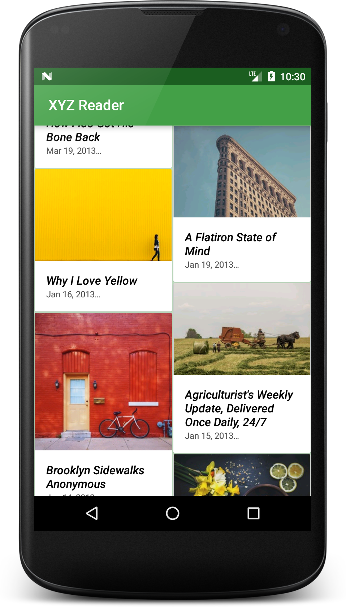
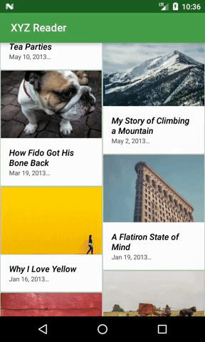

# Use of Material Design

## Overview
The objective of this project was to improve the app given a starter code. After reading feedback from users, the app was transformed by making use of Material Design principles, such as fonts, colors, motion, surfaces. By applying these principles, the app interacts with the user in a meaningful way.
XYZ Reader project is part of Udacity's Android Nanodegree.

## Demo

